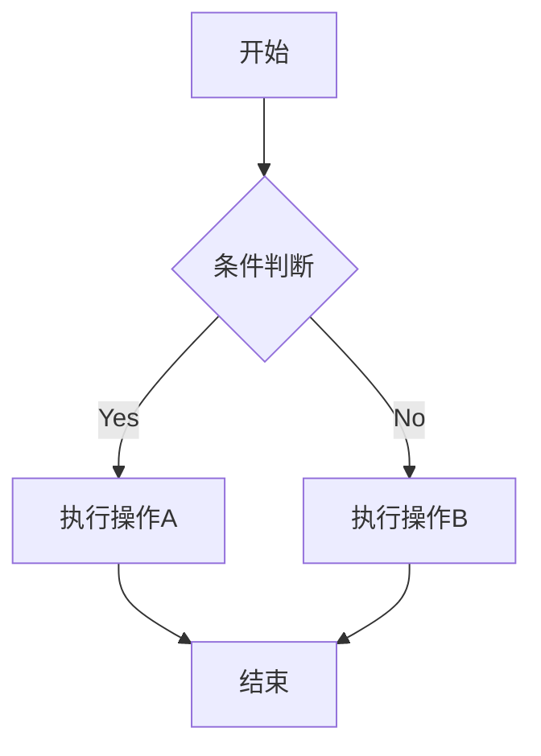
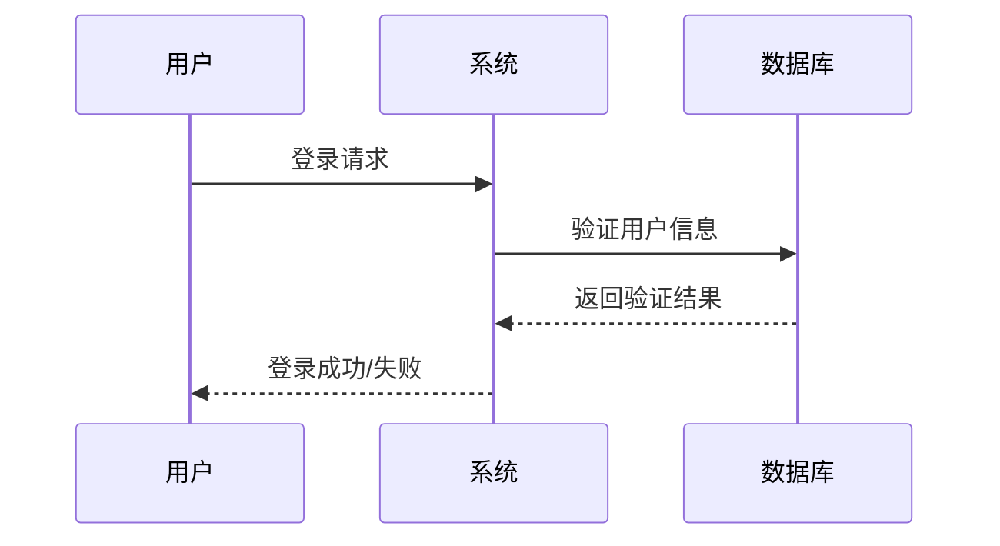
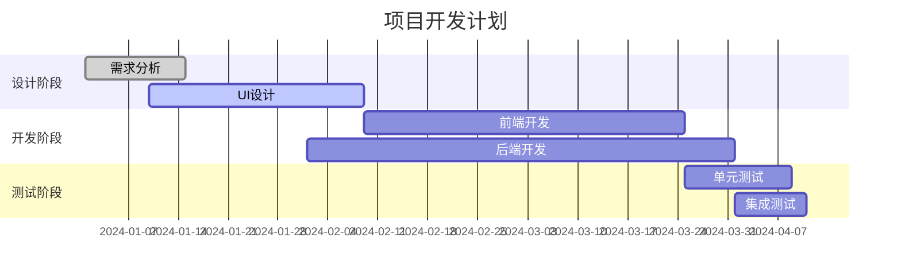
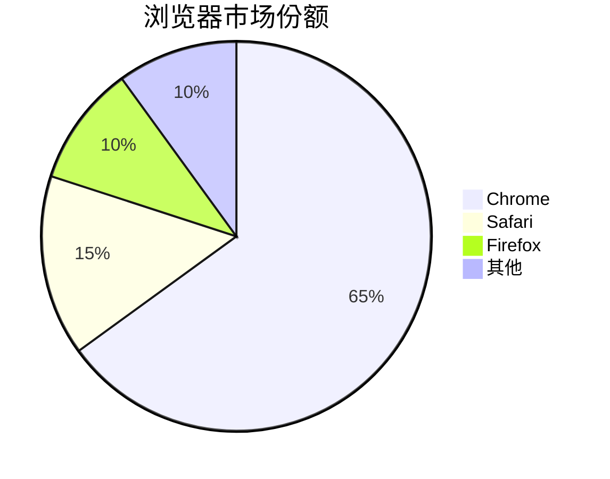
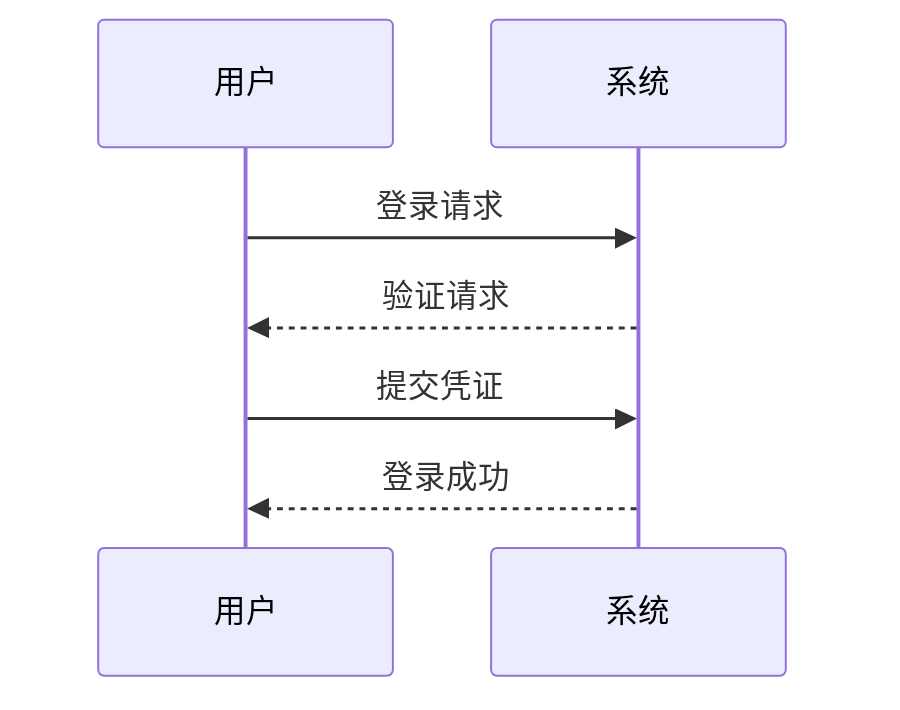
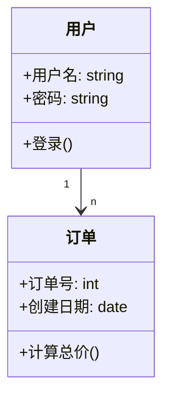
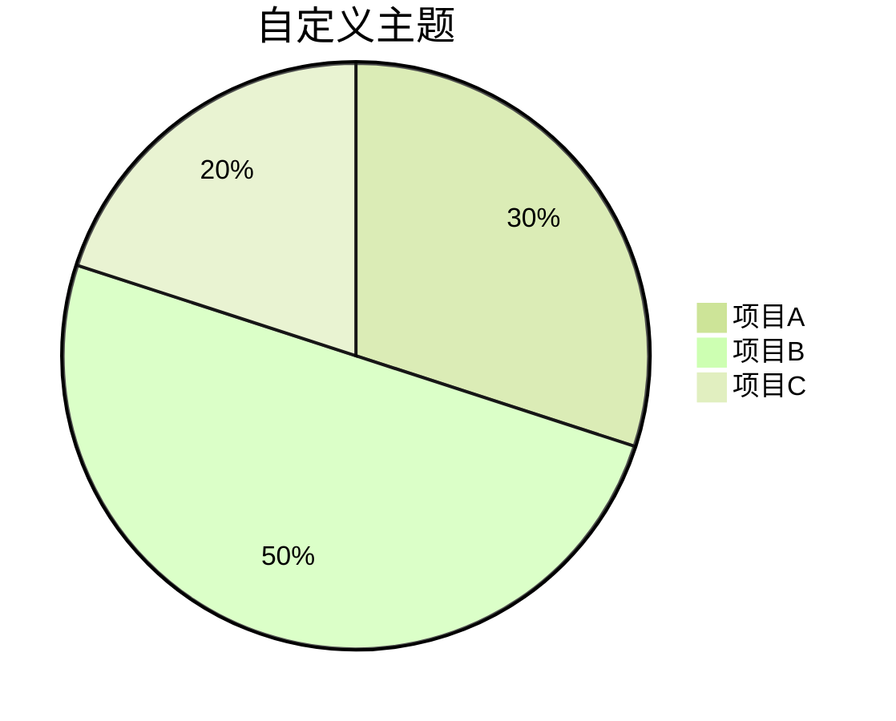
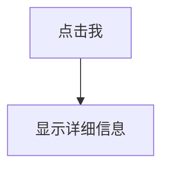

# Markdown

## 1. 标题

### 写法一：
```
一级标题
==========
二级标题
----------
```
### 写法二：
```
# 一级标题
## 二级标题

注释：以此类推，#与标题间必须有空格
```

## 2. 段落
```
第一段

第二段

注释：markdown中段落间间距一行来表示不同段落
```

## 3. 文本样式
```
粗体    **粗体**
斜体    *斜体*
粗斜体  ***粗斜体***
-------------------
删除线  ~~删除文本~~
下划线  <u>下划线文本</u>
```

## 4. 分割线
```
1.---              分割线

2.回车              markdown直接回车换行即可，也可以在文本后加上两个空格来表示换行

3.```行内代码```    行内代码的写法

4.>内容             引用的写法 

5.[^1]:脚注         脚注创建写法

注释：1.markdown使用三个及以上"-"来表示分割线
	 2.在表格中换行，使用<br>标签
	 3.行内代码有多种写法，但三个`已经满足需求，记住这个就好
	 4.引用一方面美观，还可以起到和代码块相似的突出作用
	 5.脚注创建还有另一种写法，这里记住这个就行
```

## 5. 转义字符
```
\   反斜线

`   反引号

*   星号

_   下划线

{}  花括号

[]  方括号

()  小括号

#   井字号

+   加号

-   减号

.   英文句点

!   感叹号

注释：以上若想正常显示，在前面添加一个\即可
```

## 6. 列表
```
一、无序列表

- 项目1

- 项目2

- 项目3  

二、有序列表

1. 项目1

2. 项目2

3. 项目3
   
 三、任务列表

- [ ] 任务1

- [ ] 任务2

- [ ] 任务3
```

- 注释：1. 列表可以互相嵌套，也可以放在别的内容里面
		2. 列表书写注意空格

## 7. 表格
  
### 7.1 基本表格

```
|  表头   | 表头  |

|  ----  | ----  |

| 单元格  | 单元格 |

| 单元格  | 单元格 |
```

### 7.2 设置表格对齐方式
```
| 左对齐 | 右对齐 | 居中对齐 |

| :-----| ----: | :----: |

| 单元格 | 单元格 | 单元格 |

| 单元格 | 单元格 | 单元格 |
```
  
### 7.3 表格语法要求

1. 表格的第一行是表头，用|分隔不同的单元格，每个单元格都需要有一个对齐方式

2. "-"表示上下边框,"|"表示左右边框，左右边框不必严格对齐，数量对应即可

## 8. 链接
```
1. 行内链接：[链接文字](https://www.example.com)
   
		简单写法：<https://www.example.com>

2. 参考链接：[链接文字][1]

		[1]: https://www.example.com
```

### 8.1 锚点
```
文章锚点：

1. 行内锚点：[锚点文字](#锚点id)

2. 参考锚点：[锚点文字][1]

		[1]: #锚点id

手动创建锚点：

1. 在需要创建锚点的位置添加HTML标签：`<a id="锚点id"></a>`

2. 在文章中使用锚点：[锚点文字](#锚点id)
```

## 9. 图片
```
1. 行内图片：

2. 参考图片：![图片描述][1]

		[1]: https://www.example.com/image.jpg
```
3. img标签写法:

```html


```

4. 点击图片跳转链接的markdown写法：
```
[](链接URL)
```

#### 注释
- 对于路径，需要学习相关知识，图片和网址实际相同，都和"路径"相关
- 中括号对应html里的alt属性，表示如果图片加载不出来的替代文本
- 小括号对应html里的src属性，表示路径，需要填写相对路径/绝对路径，一般推荐相对路径

## 10. 数学公式渲染
> 数学公式渲染有以下几个主流工具
> - LaTex
> - KaTex
> - MathJax

> LaTex不局限于一个公式渲染工具，而且是一个强大的排版工具
> 在vscode/trae……安装插件LaTex Workshop才能正常渲染markdown中的公式

- 关于数学公式的书写语法，这里并不准备说明，可以借助AI来实现

## 11. Mermaid图表

### 11.1 流程图




### 11.2 时序图




### 11.3 甘特图




### 11.4 饼图




### 11.5 序列图




### 11.6 类图




### 11.7 主题定制




### 11.8 交互图表



- 图表写法也借助AI生成即可
- 有些图表在obsidian加载不出来，尚且不知道是什么问题