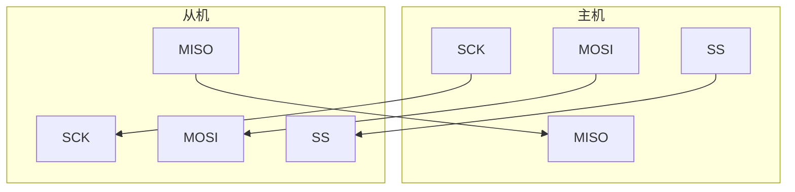
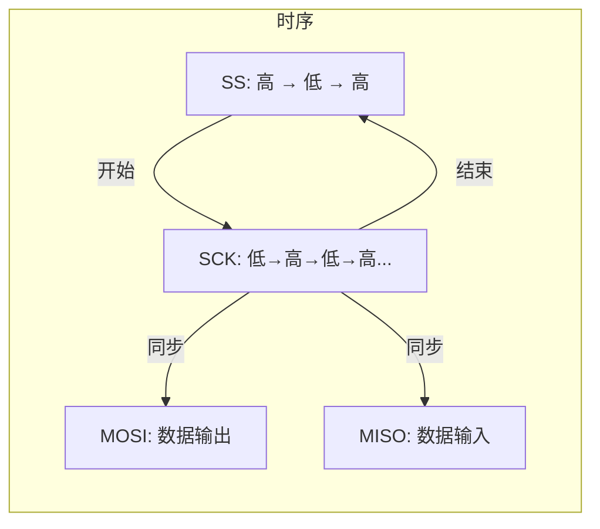

## 1. SPI基本概念

| 特性 | 描述 |
|------|------|
| 通信线 | 4根：SCK（时钟）、MOSI（主出从入）、MISO（主入从出）、SS（从机选择） |
| 通信方式 | 同步，全双工 |
| 拓扑结构 | 支持一主多从 |

## 2. 硬件电路连接

| 连接方式 | 说明 |
|---------|------|
| 主机与从机 | 所有SPI设备的SCK、MOSI、MISO分别连接在一起 |
| 从机选择 | 主机引出多条SS控制线，分别接到各从机的SS引脚 |
| 引脚配置 | 输出引脚配置为推挽输出，输入引脚配置为浮空或上拉输入 |

### 2.1 硬件连接示意图



## 3. SPI时序基本单元

### 3.1 通信开始与结束
- **起始条件**：SS从高电平切换到低电平
- **终止条件**：SS从低电平切换到高电平

#### 3.1.1 通信时序图


### 3.2 数据传输模式（模式0）
| 模式参数 | 说明 |
|---------|------|
| CPOL=0 | 空闲状态时，SCK为低电平 |
| CPHA=0 | SCK第一个边沿移入数据，第二个边沿移出数据 |

#### 3.2.1 数据传输时序图（模式0）



## 4. 如何使用SPI通信

### 4.1 初始化配置
1. 配置SPI时钟频率
2. 设置数据位宽度（通常为8位）
3. 选择SPI模式（通常为模式0）
4. 配置GPIO引脚（SCK、MOSI、MISO为复用功能，SS为推挽输出）

### 4.2 通信步骤
1. **选择从机**：将对应从机的SS引脚拉低
2. **数据传输**：
   - 主机通过MOSI发送数据
   - 同时通过MISO接收从机返回的数据
   - 数据在SCK的边沿同步传输
3. **结束通信**：将SS引脚拉高，释放从机

## 配置代码：
- 软件SPI
```
	//写入SS
void SoftSPI_W_SS(uint8_t BitValue)
{
    GPIO_WriteBit(GPIOA, GPIO_Pin_4, (BitAction)BitValue);
}
	
	//写入SCK
void SoftSPI_W_SCK(uint8_t BitValue)
{
    GPIO_WriteBit(GPIOA, GPIO_Pin_5, (BitAction)BitValue);
}
	
	//写入MOSI
void SoftSPI_W_MOSI(uint8_t BitValue)
{
    GPIO_WriteBit(GPIOA, GPIO_Pin_7, (BitAction)BitValue);
}
	
	//读取MISO
uint8_t SoftSPI_R_MISO(void)
{
    return GPIO_ReadInputDataBit(GPIOA, GPIO_Pin_6);
}

void SoftSPI_Init(void)
{
	//使能GPIO的RCC时钟
    RCC_APB2PeriphClockCmd(RCC_APB2Periph_GPIOA, ENABLE);
    
    //配置SS/SCK/MOSI
    GPIO_InitTypeDef GPIO_InitStructure;
    GPIO_InitStructure.GPIO_Mode = GPIO_Mode_Out_PP;
    GPIO_InitStructure.GPIO_Pin = GPIO_Pin_4 | GPIO_Pin_5 | GPIO_Pin_7;
    GPIO_InitStructure.GPIO_Speed = GPIO_Speed_50MHz;
    GPIO_Init(GPIOA, &GPIO_InitStructure);
    
    //配置MISO
    GPIO_InitStructure.GPIO_Mode = GPIO_Mode_IPU;
    GPIO_InitStructure.GPIO_Pin = GPIO_Pin_6;
    GPIO_Init(GPIOA, &GPIO_InitStructure);
    
    //初始化引脚
    SoftSPI_W_SS(1);
    SoftSPI_W_SCK(0);
    SoftSPI_W_MOSI(0);
}
	
	//发送一个字节
uint8_t SoftSPI_Transfer(uint8_t Byte)
{
    uint8_t i;
    for (i = 0; i < 8; i++)
    {
        SoftSPI_W_MOSI((Byte & 0x80) >> 7);
        SoftSPI_W_SCK(1);
        Byte <<= 1;
        Byte |= SoftSPI_R_MISO();
        SoftSPI_W_SCK(0);
    }
    return Byte;
}
```
- 硬件SPI
```
	//硬件写入SS
void HardSPI_W_SS(uint8_t BitValue)
{
    GPIO_WriteBit(GPIOA, GPIO_Pin_4, (BitAction)BitValue);
}
	
uint8_t HardSPI_Transfer(uint8_t Byte)
{
    while (SPI_I2S_GetFlagStatus(SPI1, SPI_I2S_FLAG_TXE) == RESET);
    SPI_I2S_SendData(SPI1, Byte);
    while (SPI_I2S_GetFlagStatus(SPI1, SPI_I2S_FLAG_RXNE) == RESET);
    return SPI_I2S_ReceiveData(SPI1);
}
	
void HardSPI_Init(void)
{
	//使能GPIO与SPI的RCC时钟
    RCC_APB2PeriphClockCmd(RCC_APB2Periph_GPIOA, ENABLE);
    RCC_APB2PeriphClockCmd(RCC_APB2Periph_SPI1, ENABLE);
    
    //GPIO配置
    GPIO_InitTypeDef GPIO_InitStructure;
    
    //配置SS引脚
    GPIO_InitStructure.GPIO_Mode = GPIO_Mode_Out_PP;
    GPIO_InitStructure.GPIO_Pin = GPIO_Pin_4;
    GPIO_InitStructure.GPIO_Speed = GPIO_Speed_50MHz;
    GPIO_Init(GPIOA, &GPIO_InitStructure);
    
    //配置SCK引脚
    GPIO_InitStructure.GPIO_Mode = GPIO_Mode_AF_PP;
    GPIO_InitStructure.GPIO_Pin = GPIO_Pin_5 | GPIO_Pin_7;
    GPIO_Init(GPIOA, &GPIO_InitStructure);
    
    //配置MISO引脚
    GPIO_InitStructure.GPIO_Mode = GPIO_Mode_IPU;
    GPIO_InitStructure.GPIO_Pin = GPIO_Pin_6;
    GPIO_Init(GPIOA, &GPIO_InitStructure);
    
    /*SPI配置
    *1.预分配2
    *2.时钟相位为第1个边沿
    *3.时钟极性为低电平
    *4.CRC多项式
    *5.数据宽度为8位
    *6.全双工模式
    *7.高位先发送
    *8.主机模式
    *9.软件片选
    */
    SPI_InitTypeDef SPI_InitStructure;
    SPI_InitStructure.SPI_BaudRatePrescaler = SPI_BaudRatePrescaler_2;
    SPI_InitStructure.SPI_CPHA = SPI_CPHA_1Edge;
    SPI_InitStructure.SPI_CPOL = SPI_CPOL_Low;
    SPI_InitStructure.SPI_CRCPolynomial = 7;
    SPI_InitStructure.SPI_DataSize = SPI_DataSize_8b;
    SPI_InitStructure.SPI_Direction = SPI_Direction_2Lines_FullDuplex;
    SPI_InitStructure.SPI_FirstBit = SPI_FirstBit_MSB;
    SPI_InitStructure.SPI_Mode = SPI_Mode_Master;
    SPI_InitStructure.SPI_NSS = SPI_NSS_Soft;
    SPI_Init(SPI1, &SPI_InitStructure);
    
    //使能SPI
    SPI_Cmd(SPI1, ENABLE);
    
    HardSPI_W_SS(1);
} 
	
	//硬件发送一个字节
uint8_t HardSPI_Transfer(uint8_t Byte)
{
    while (SPI_I2S_GetFlagStatus(SPI1, SPI_I2S_FLAG_TXE) == RESET);  //等待发送缓冲区为空
    SPI_I2S_SendData(SPI1, Byte);  //发送数据
    while (SPI_I2S_GetFlagStatus(SPI1, SPI_I2S_FLAG_RXNE) == RESET);  //等待接收缓冲区非空
    return SPI_I2S_ReceiveData(SPI1);  //返回接收数据
}
```