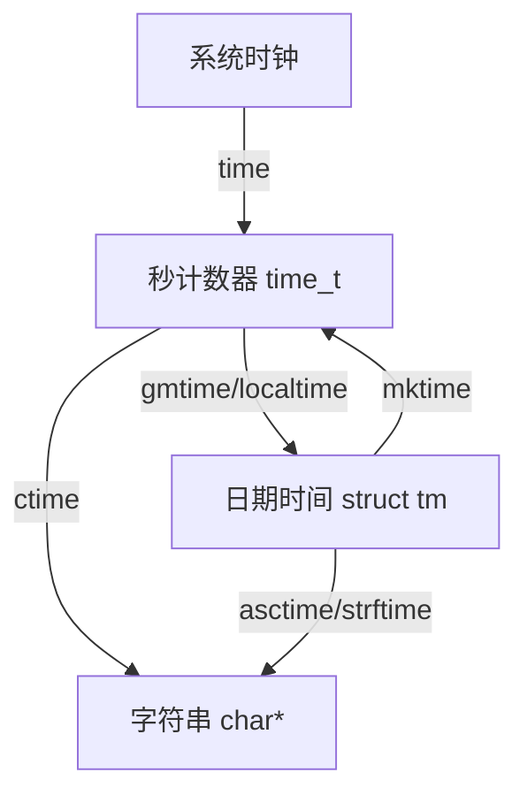

## Unix时间戳

- Unix 时间戳 (Unix Timestamp) 定义为从UTC/GMT的1970年1月1日0时0分0秒开始所经过的秒数，不考虑闰秒
- 时间戳存储在一个秒计数器中，秒计数器为32位/64位的整型变量
- 世界上所有时区的秒计数器相同，不同时区通过添加偏移来得到当地时间

```
秒计数器       0               1000000000         1672588795
                |----------------|----------------|---------------->
日期时间         1970-1-1         2001-9-9         2023-1-1
(伦敦)          0:00            1:46:40          15:59:55
日期时间         1970-1-1         2001-9-9         2023-1-1
(北京)          8:00            9:46:40          23:59:55
```

## UTC/GMT

- GMT (Greenwich Mean Time) 格林尼治标准时间是一种以地球自转为基础的时间计量系统。它将地球自转一周的时间间隔等分为24小时，以此确定计时标准
- UTC (Universal Time Coordinated) 协调世界时是一种以原子钟为基础的时间计量系统。它规定铯133原子基态的两个超精细能级间在零磁场下跃迁辐射9,192,631,770周所持续的时间为1秒。当原子钟计时一天的时间与地球自转一周的时间相差超过0.9秒时，UTC会执行闰秒来保证其计时与地球自转的协调一致

## 时间戳转换

C语言的time.h模块提供了时间获取和时间戳转换的相关函数，可以方便地进行秒计数器、日期时间和字符串之间的转换

| 函数                                                             | 作用                  |
| -------------------------------------------------------------- | ------------------- |
| time_t time(time_t*);                                          | 获取系统时钟              |
| struct tm* gmtime(const time_t*);                              | 秒计数器转换为日期时间（格林尼治时间） |
| struct tm* localtime(const time_t*);                           | 秒计数器转换为日期时间（当地时间）   |
| time_t mktime(struct tm*);                                     | 日期时间转换为秒计数器（当地时间）   |
| char* ctime(const time_t*);                                    | 秒计数器转换为字符串（默认格式）    |
| char* asctime(const struct tm*);                               | 日期时间转换为字符串（默认格式）    |
| size_t strftime(char*, size_t, const char*, const struct tm*); | 日期时间转换为字符串（自定义格式）   |

## 时间戳转换流程


